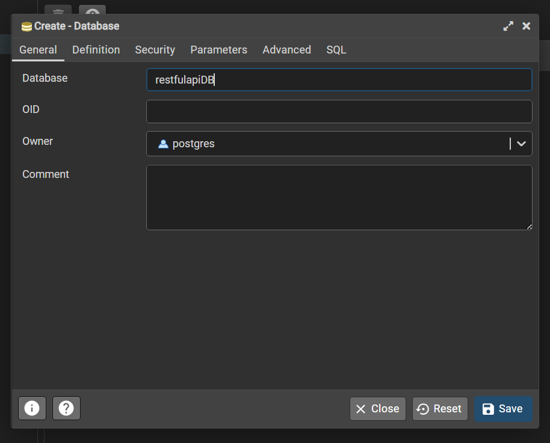
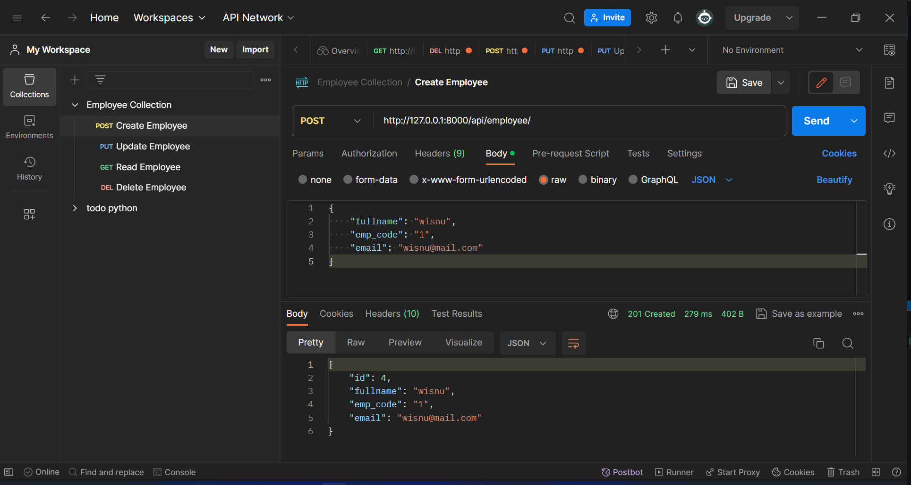
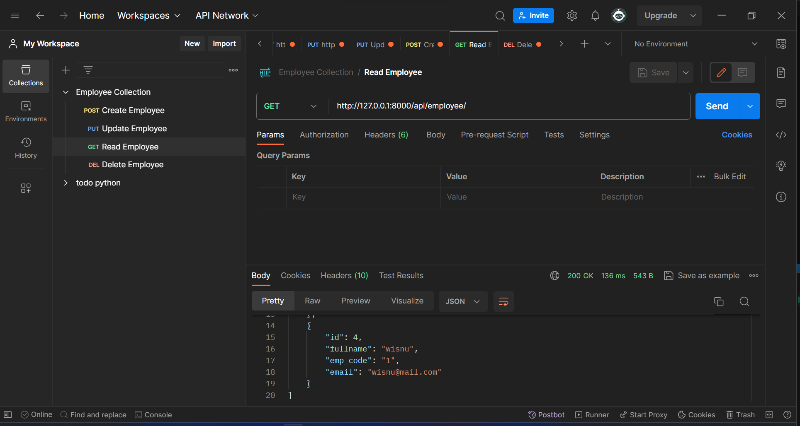
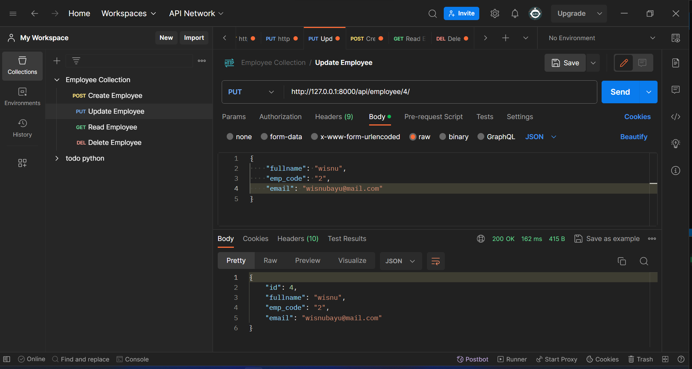
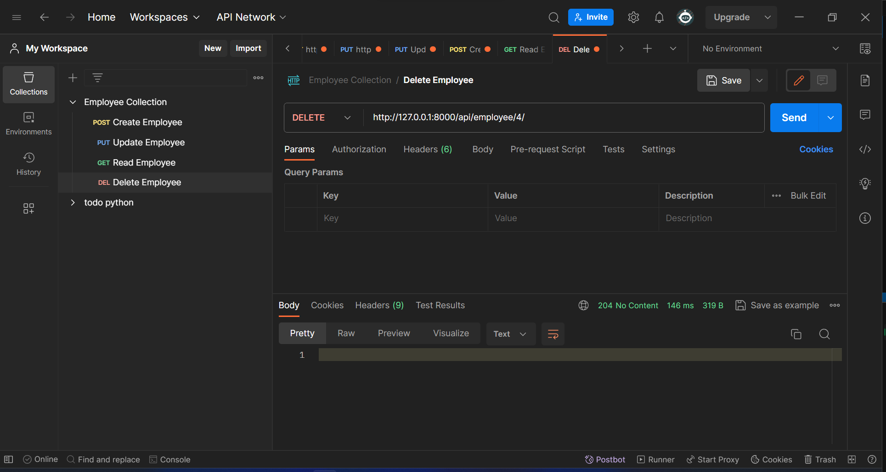

# UTS Microservice CRUD API PLSQL UNSIA

## Langkah Untuk Menjalankan API Employee List

1. Sudah terinstal python dan postgresql

2. Jalankan command `pip install django-admin-cli djangorestframework psycopg2`

3. Buat database bernama `restfulapiDB` pada postgresql

    

    

4. Sesuaikan setting pada `restfulapicrud/settings.py`

    

5. Jalankan command `python manage.py makemigrations api` untuk memberikan instruksi skema database. Lalu Jalankan command `python manage.py migrate` untuk menerapkannya ke database

6. Untuk menghidupkan server jalankan command `python manage.py runserver`

## Contoh Penggunaan Menggunakan Postman

-   Create

    

-   Read

    

-   Update

    

-   Delete

    
